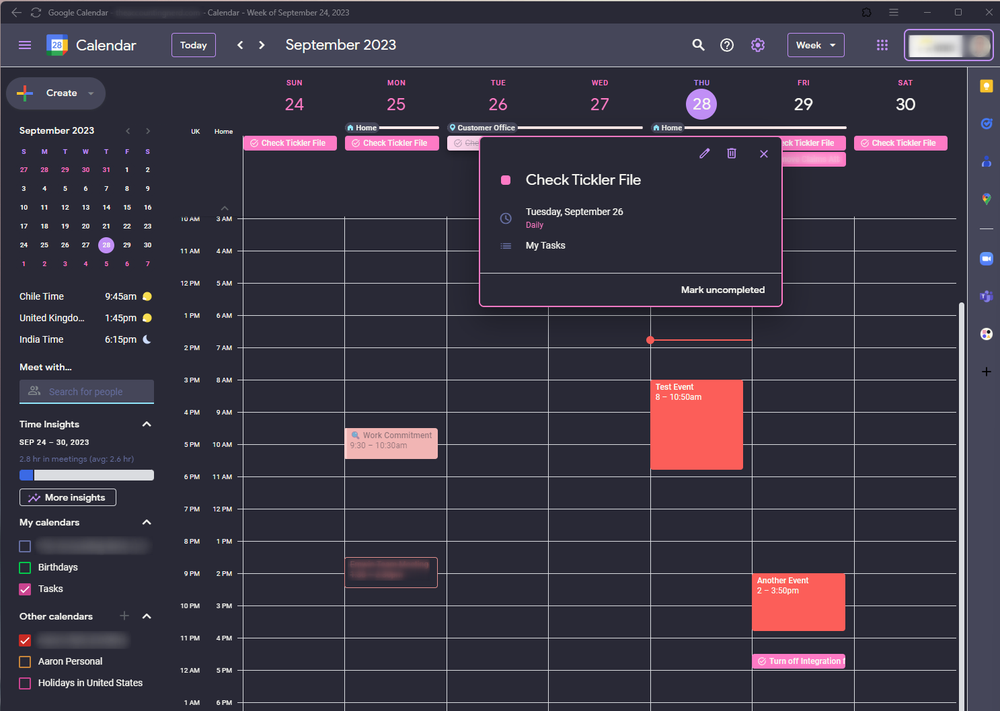

# Dracula for [Google Calendar](https://calendar.google.com/)

> A dark theme for [Google Calendar](https://calendar.google.com/).

## Install

All instructions can be found at [draculatheme.com/google-calendar](https://draculatheme.com/google-calendar).

## Team

This theme is maintained by the following person(s) and a bunch of [awesome contributors](https://github.com/dracula/google-calendar/graphs/contributors).

|    |              |
|---------|---------|
| [Aaron Clark](https://github.com/accountingnerd)                                                      | [José Manuel Lucas](https://github.com/jmlweb)                                                        |

## Community

- [Twitter](https://twitter.com/draculatheme) - Best for getting updates about themes and new stuff.
- [GitHub](https://github.com/dracula/dracula-theme/discussions) - Best for asking questions and discussing issues.
- [Discord](https://draculatheme.com/discord-invite) - Best for hanging out with the community.

## License

[MIT License](./LICENSE)
